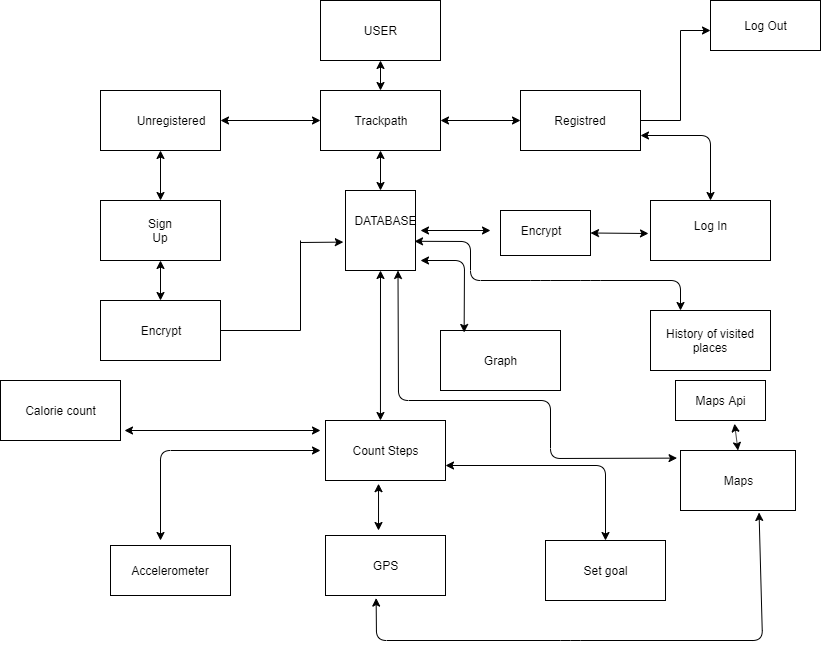

Functional Specification for Trackpath

1. Introduction

-   1.1 Overview

-   1.2 Business Context

-   1.3 Glossary

2. General Description

-   2.1 Product Functions/System Functions

-   2.2 User Characteristics and Objectives

-   2.3 Operational Scenarios

-   2.4 Constraints

3. Functional Requirements

-   3.1 Sign Up

-   3.2 Log In

-   3.3 Log Out

-   3.4 Graph

-   3.5 Count Steps

-   3.6 Set Goal

-   3.7 Calorie Count

-   3.8 History of Visited Places

-   3.9 Maps

4. System Architecture

1.  Introduction

1.1 Overview

The app being designed is called ‘Trackpath’ which is best described as a
fitness app. The app will automatically track the users steps and activity
throughout the day. The apps purpose will be to offer a cheaper alternative to
replace the expensive hardware on the market such as Fitbit or Garmin
pedometers. It will provide the same benefits by only carrying your smartphone
around. The app will show you a map of the routes you have travelled throughout
the day.

The home screen of the app will show steps accumulated, distance travelled,
calories burned and a scrollable timeline.

Trackpath will not only be able to track daily steps but it will also be able to
track your movements throughout the day and provide you with a timeline showing
you where you have been throughout the day.

Example.

9:00 - 9:10 - Walk

9:10 - 9:20 - Costa

9:20 - 9:30 - Walk

9:30 - 10:30 - Office

1.2 Business Context

In the business context of this product there could be two possibilities.

-   Put the app on Google Play Store for free. Put ads on the free version of
    the app. Option to upgrade to the pro version of the app which will be ad
    free and have more features.

-   Selling the product to an external organisation. They could modify the
    product or keep it as it is or they could adapt it to their own product.

1.3 Glossary of terms

-   Java

    -   General purpose programming language that is class-based,
        object-oriented, and designed to have as few implementation
        [dependencies](https://en.wikipedia.org/wiki/Dependency_(computer_science))
        as possible. It is intended to let [application
        developers](https://en.wikipedia.org/wiki/Application_developer) write
        once, run anywhere.

-   GPS

    -   Global Positioning System

-   Realm

    -   Open source object database management system

-   Google Play Store

    -   A digital distribution server operated and developed by Google.

-   Cloud Server

    -   A cloud server is a virtual server running a cloud computing
        environment. It is built, hosted and delivered via a cloud computing
        platform via the internet and can be accessed remotely.

1.  General Description

2.1 Product Functions / System Functions

Below is a preliminary list of the main functions which may have extra features
if we think they are worth adding. Each function will be discussed in more
detail in the following section.

-   Sign up

-   Log in\*

-   Log out\*

-   Edit profile\*

-   Count steps

-   Graph\*

-   Set goal\*

-   Calorie count\*

-   History of places visited (days/weeks/months) \*

-   Maps\*

*\*Requires LogIn*

2.2 User Characteristics and Objectives

The app will be available for free on the Google Play Store. So anybody with an
Android smartphone will have access to the app. The target audience will be
males and females who are interested in keeping track of their daily steps and
their daily activity throughout the day.

Once the app is downloaded, the app with prompt the user to give permission to
use GPS on their device. The user then has to sign up and create an account. The
user will then be able to create goals that they would like to reach eg. walk
10,000 steps a day or be active for 2 hours.

2.3 Operational Scenarios

For the design of our application there will be three different scenarios under
which the app will perform. The first scenario is where the user is unregistered
and in order to access the application content the user will be prompted with a
Sign Up form or if he already has an account he will be prompted with a LogIn
form.

-   Unregistered User

>   The unregistered user will only be able to see the app logo and have an
>   option to Sign Up where he will be redirected to complete a form where the
>   first name, last name, age, email and a password will be needed in order to
>   create the account.

-   Register user (not logged in)

>   The user will be asked to enter the email and password chosen in the step
>   above in order to log in. If the login is successful access will be granted
>   else he will be asked to enter the details again.

-   Registered user (logged in)

>   The registered user will be able to see the apps logo where and have an
>   option to log in where he will be asked for the email and password that was
>   used to create their account. If the LogIn is successful the user will be
>   allowed to use the application functions

-   *Set goal\**

>   Where the user can set a goal of steps/distance in order to keep motivated.

-   *Count Steps\**

>   The count steps function will be displayed on the main page and it will
>   automatically display the number of steps taken on that day.

-   *Calorie count\**

>   The user can check the estimated amount of calories burned at the time they
>   access the function.

-   *Graph\**

>   A graph will visualise the last 7 days in order to see how active they have
>   been and see which day has the most steps they have taken.

-   *History of visited places\**

>   The user will be able to go to the history of the places they have visited
>   since their account has been created. They will come up sorted in
>   chronological order and the user will be able to select certain
>   days/weeks/months and check where they were at the chosen moment.

-   *Maps\**

>   Here the user can access a map with the route that they have travelled in
>   that particular day. With the help with this function the user can see which
>   route has more steps and increase/decrease the steps number by choosing
>   another route.

\**Requires LogIn*

2.4 Constraints

The one real constraint we are really facing are regarding the storage space and
the deadline.

-   *Database Memory*

>   Because we are using the Realm Database we have a limit on the scale we can
>   test this application. We will be unable to test the application on a high
>   scale with multiple users logged in at the same time, where problems may
>   arise in terms of memory.

-   *Time*

>   As this project has the potential to grow and gather a lot of users, the
>   deadline will be there in order to demonstrate the application at a low
>   level where the main functionality is created and not for how the
>   application will evolve in time.

-   *Efficiency*

>   As the application will run in the background in order to calculate the data
>   from the GPS and accelerometer the battery life may drain very fast. In
>   order to calculate the steps the data from the GPS and accelerometer will
>   have to be calculated and we will do our best to make the calculations as
>   fast and precise they can be.

-   *Cloud server*

>   In order to store the information about the steps/distance travelled and the
>   history of the places visited we will have to store them into a cloud server
>   where for now the amount of storage will be limited because we cannot afford
>   to pay for full subscription as the packages are very expensive for the full
>   version.

1.  Functional requirements

3.1 Sign Up

-   *Description*

>   The Sign Up is the first function that a non registered user comes across.
>   In order to create an account the user will have to enter some mandatory
>   pieces of data in order to go through to the next step in order to complete
>   the registration process.

-   *Criticality*

>   This function is critical to the whole idea of our application, without it
>   the user wouldn’t be able to have access to the content of the application
>   therefore the user wouldn’t be able to use the application as intended.

-   *Technical Issues*

For a successful Sign Up we will have to check and validate the

email address and password will have to be encrypted using

cipher with a key known just by us before it gets stored in the

Database.

-   *Dependency*

>   None

3.2 Log In

-   *Description*

>   The login function allows the user to access their newly created account.
>   The login will simply require the email and password provided when the
>   account was created.

-   *Criticality*

>   The login function is very important as without it the user wouldn’t have
>   access to their stored data and the functionality that the app as to offer.

-   *Technical Issues*

>   The only concerns regarding the login function is the decryption. When the
>   user will enter the password it will query the database which will have to
>   return the decrypted password and test to see if it matches the users
>   password.

-   *Dependency*

>   The login function is only dependent on the Sign up function, in order to
>   login you must have an account created.

3.3 Log out

-   *Description*

>   The log out function will allow the user to exit the application, the
>   application will run in the background and if the user wants to stop it he
>   can simply logout.

-   *Criticality*

>   When the user will choose to log out the application will stop recording any
>   values from the GPS and accelerometer so the steps/distance will stop
>   recording.

-   *Technical issues*

>   If the user does logout he will have to login and enter the details again
>   e.g email and password.

-   *Dependency*

>   This function is dependent on the login function. In order to log out the
>   user must be logged in and all its dependencies.

3.4 Graph

-   *Description*

>   This function will allow the user to see a graph with the steps/distance
>   between the last 7 days. With the help of this function the user can see in
>   which day of the week he was the most active.

-   *Criticality*

>   In order to get an accurate graph, the user has to use the app for a seven
>   day period. Otherwise the graph will be missing data and the average steps
>   for that week won’t be calculated accurately as data is missing.

-   *Technical issues*

>   None

-   *Dependency*

>   This functional requirement depends on the log in function and all its
>   dependencies

3.5 Count steps

-   *Description*

>   With the help of this function the user will see the number of steps
>   displayed on the home page. It will update the values automatically this
>   being the reason we are using the Realm database.The function will interact
>   directly with the GPS and accelerometer, get the data and process it and
>   update the counter which will be stored in database at the end of the day .
>   The steps for one day will be between 00:00 to 23:59 after which it will
>   reset to 0 for the following day.

-   *Criticality*

>   In order for this function to work as intended the GPS must be on at all
>   times and the user must be logged in so the app can record the steps.

-   *Technical Issues*

>   The only issue we can find about this function is if the user travels abroad
>   the time might have a problem as the app might work on the original time
>   from the country that the user created the account.

-   *Dependency*

>   Dependent on the LogIn with all its dependencies and the database.

3.6 Set Goal

-   *Description*

>   The set goal function will allow the user to set a goal eg. a number of
>   steps they aim to take in a day. It could motivate the user to exercise more
>   to reach their goals and therefore to be more healthy. The user will be
>   prompted by the app with an encouraging message when the goal is reached.

-   *Criticality*

>   None

-   *Technical issues*

>   In order for the function to work the Count Steps function should be active
>   and register the steps.

-   *Dependency*

>   It is dependent on the Count Steps function and all its dependencies.

3.7 Calorie count

-   *Description*

>   This will be a simple function which will calculate the average number of
>   calories burned by the user. It will be calculated by a well defined
>   formula. The user will have to input his height and weight.

-   *Criticality*

>   None

-   *Technical Issues*

>   The only issue that we can think of it is that if the user doesn’t input his
>   height and weight this function won’t be able to calculate an estimate or if
>   the user inputs incorrect values the function will display the calories
>   burned based on those values.

-   *Dependency*

>   Dependent on the Count steps function and all its dependencies

3.8 History of Visited Places

-   *Description*

>   With the help of this function the user will have the chance to scroll and
>   look through the history of locations that they have been since the
>   application has been active.

-   *Criticality*

>   In order for this function to work the user will have the GPS active at all
>   times so the information can be recorded in the database.

-   *Technical Issues*

>   The memory constraints of the database might be an issue but since the app
>   won’t have many users in the testing phase that shouldn't be a problem but
>   it is worth considering.

-   *Dependency*

>   This function is fully dependent on the GPS and the Realm Database

3.9 Maps

-   *Description*

>   This function will use the same concept as the one mentioned above but with
>   a twist. Rather than showing you the location, the streets and places
>   visited will be highlighted showing the route the user has taken and appear
>   on the map.

-   *Criticality*

In order for this function to show the route travelled it will have to

interact with the Google maps API so it will require internet

access.

-   *Technical Issues*

>   None

-   *Dependency*

>   Dependent on the GPS being active and having an internet connection.

1.  System Architecture

>   User

>   The user will interact with the application where he will have the option to
>   Sign up or LogIN

>   Database

>   The application will interact with the database storing and retrieving
>   information.

>   GPS

>   With the help of this sensor the application will calculate and then store
>   and retrieve information.

Accelerometer

>   With the help of this sensor the application will calculate and then store
>   and retrieve information.

>   Google Maps Api

>   The application will interact with the Google Maps Api in order to retrieve
>   street names, locations.

>   5.High-Level Design

>   Above is the high level diagram which shows how the application will work
>   internally and the functions will be connected to each other.

>   6. Preliminary Schedule

Using a Gantt chart we were able to visualise the project timeline and plan. The
dates

